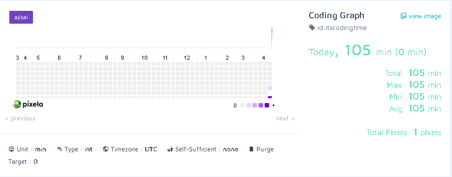

# 🧠 Pixela Coding Time Tracker ⏱️

A lightweight Python script to track your daily coding minutes using the [Pixela API](https://pixe.la/). Log your progress, stay motivated, and visualize your coding habits on a beautiful graph — all from the terminal!

---

## 🚀 Description
This project allows you to:
- Create a Pixela user and graph 
- Log your daily coding time in minutes
- Delete entries in case of a mistake

Perfect for developers who love keeping track of their habits in a simple and visual way.

---

## ✨ Features
- Auto-creation of Pixela user and graph
- Interactive CLI: choose to add or delete today's entry
- Exception handling for smooth user experience
- Environment variable management via `.env`

---

## 🛠️ How to Use

1. **Clone the repo:**
```bash
git clone https://github.com/Tsaousidis/code-tracker.git
cd code-tracker
```

2. **Set up `.env` file:**
Create a `.env` file in the root directory and add your Pixela credentials:
```env
USER_TOKEN = your_pixela_token
MY_USERNAME = your_pixela_username
```

4. **Run the script:**
```bash
python main.py
```
Choose to add or delete today's log.

---

## 💻 System Requirements
- Python 3.8+
- `requests`
- `python-dotenv`

---

## 📸 Screenshot


---

## 🧰 Tech Stack
- Python 3
- Pixela API
- Dotenv
- Requests

---

## 👨‍💻 Created by [Tsaousidis](https://github.com/Tsaousidis)
🎉 Have fun playing! Let me know your thoughts and suggestions! 🎉
